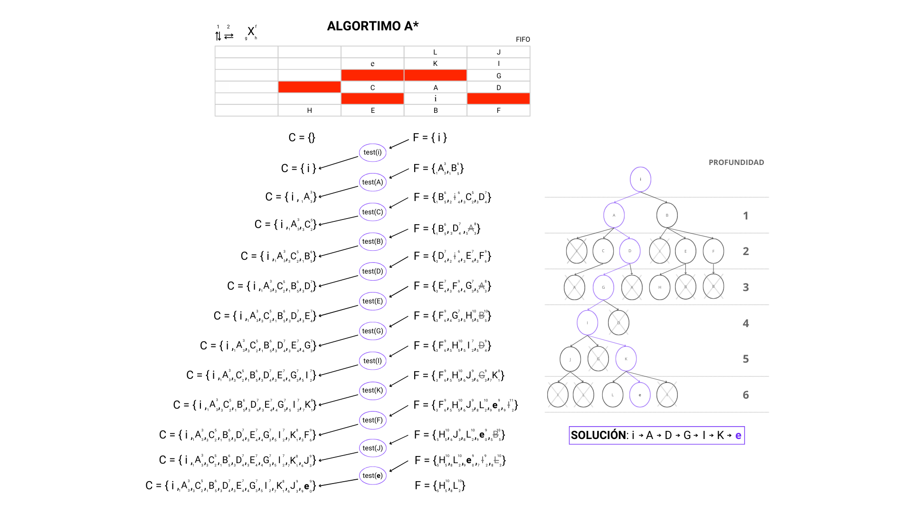

# Busquedas
Resolución de problemas mediante búsquedas.

## Ejercicio 1. Búsqueda en anchura

## Ejercicio 2. Algoritmo A*

1. La heurística utilizada en el algoritmo A, ¿es admisible? ¿Por qué?
Sí lo es, porque la heurística no sobreestime, por lo tanto, sí, es admisible.
- ¿Podemos decir que el algoritmo es A*?
Sí, podemos decir que es A*.

## Ejercicio 3. Búsqueda por Coste Uniforme

